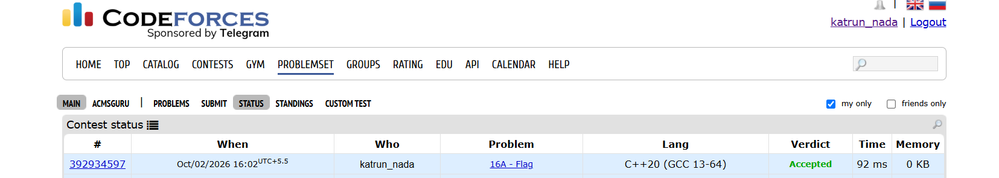
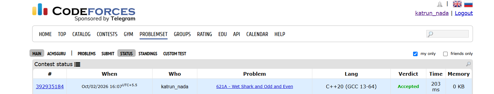

# Day-2-#1[16A-Flag]
## Problem Description
a flag of every country should have a chequered field n × m, each square should be of one of 10 colours, and the flag should be «striped»: each horizontal row of the flag should contain squares of the same colour, and the colours of adjacent horizontal rows should be different. 
## Approach-
We scan the whole grid and check 2 things:
1.for same row-all colours must be same 
2.Adjacent rows-colours must be different
Since each row is already confirmed to have one colour, we only need to compare the first element.

## Complexity-
Time: O(n × m)-we check every cell once.
Space: O(n × m)-we store the grid.

## Code-
```cpp
#include<iostream>
#include<vector>
#include<string>
using namespace std;
int main(){
    int n,m;
    cin>>n>>m;
    vector<string>grid(n);
    for(int i=0;i<n;i++){
        cin>>grid[i];
    }
    for(int i=0;i<n;i++){
        for(int j=0;j<m-1;j++){
            if(grid[i][j]!=grid[i][j+1]){
                cout<<"NO";
            return 0;

            }
            
        }
        if(i<n-1){
            if(grid[i][0]==grid[i+1][0]){
                cout<<"NO";
                return 0;
            }
        }
    }
    cout<<"YES";
    return 0;
}
```
## Accepted Submission


# 2-621A-[Wet Shark and Odd and Even]


## Problem Description
we have given n integers. Using any of these integers no more than once, we want to get maximum possible even (divisible by 2) sum. 
## Approach-
we compute the sum of all elements if the sum is divisible by 2 simply return the sum, the other case must be sum is odd so will simply subtract the min odd element.
## Complexity-
Time: O(n) (one traversal needed, as will parallelly find the min odd element)
Space: O(1)
## Code-
```cpp
#include<iostream>
#include<algorithm>
using namespace std;
int main(){
    int n;
    cin>>n;
    long long sum=0;
    long long minodd=1e18;
    for(int i=0;i<n;i++){
        long long x;
        cin>>x;
        sum+=x;
        if(x%2!=0){
            minodd=min(minodd,x);
        }
    }
    if(sum%2==0){
        cout<<sum;

    }else{
        cout<<sum-minodd;
    }
    return 0;
}
```
## Accepted Submission

