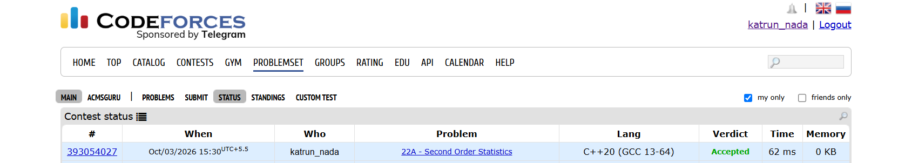
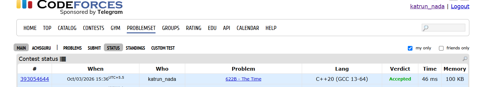

# Day-3-#1[22A-Second Order Statistics]
## Problem Description
choose each number from the sequence exactly once and sort them. The value on the second position is the second order statistics of the given sequence. In other words it is the smallest element strictly greater than the minimum. 
## Approach-
1.Initialise a set (set stores unique elements in sorted order).
2.So the second smallest element is the second element of the set.
3.But we can't directly access by index. so we will use an iterator.

## Complexity-
Time: O(n log n) because each set.insert() takes O(log n).
Space: O(n) for the set.

## Code-
```cpp
#include <iostream>
#include <set>
using namespace std;
int main(){
    int n;
    cin>>n;
    set<int>s;
    for(int i=0;i<n;i++){
        int x;
        cin>>x;
        s.insert(x);
    }
    if(s.size()<2){
        cout<<"NO";
    }else{
        auto it=s.begin();
        it++;
        cout<<*it;
    }
    return 0;

}

```
## Accepted Submission


# 2-622B-[The Time]

## Problem Description
You are given the current time in 24-hour format hh:mm. Find and print the time after a minutes.
Note that you should find only the time after a minutes,
## Approach-
1.Convert everything into total minutes,
2.Add a
3.Now because one day has:24*60 minutes, we have to take modulus (ensures new day beginning start from 00:00)
4.Convert them back in hour and minute format.
Note-while printing if newHour/newMinute < 10 have to print a 0 first.
## Code-
```cpp

#include <iostream>
using namespace std;
int main(){
    int h,m;
    char colon;
    cin>>h>>colon>>m;
    int a;
    cin>>a;
    int total=h*60+m;
    total=(total+a)%(24*60);
    int newHour=total/60;
    int newMinute=total%60;
    if(newHour<10)
    cout<<"0";
    cout<<newHour<<colon;
    if(newMinute<10)
    cout<<"0";
    cout<<newMinute;
    return 0;
}
```
## Accepted Submission

